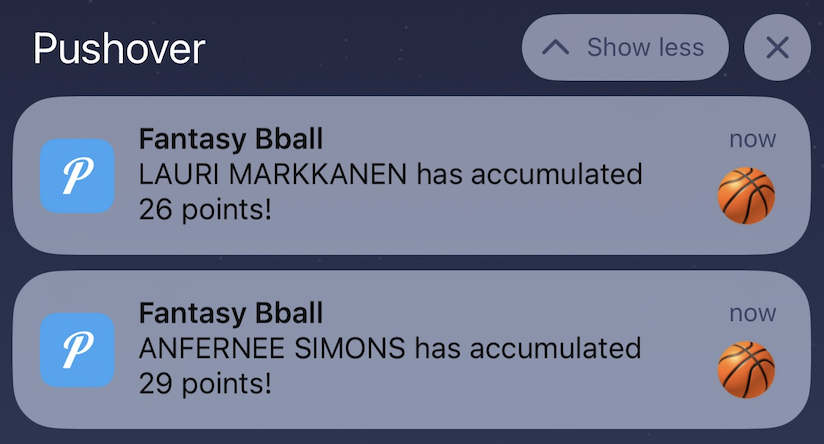

# 🔔🏀 HoopsAlert 🏀🔔

## Overview
When playing fantasy basketball, it can be hard to keep up with box scores of the many games that happen each day. This tool will do that for you. HoopsAlert scrapes the daily box scores periodically throughout the day, and sends a push notification if a low-profile player likely to be on your waiver wire has accumulated significant stats.

## Features
### Real-time Notifications
The frequency of which the scraper runs is configurable, and notifications can be sent even before games are done. For example, if Dillon Brooks has accumulated 4 steals and 3 blocks but it's only the 2nd quarter, a push notification will be sent regardless of the game being in progress or not. The only thing that matters are the stats accumulated. This way, we can minimize the time between good stats accumulated and notification sent, maximizing your chances of picking up this player as fast as possible.  
### User Preferences (WIP)
Stores user information in AWS DynamoDB, allowing for configurable settings by user. For example, users can set their own criteria for being notified (e.g. when a player reaches 7 assists or 2 steals).

## How It Works

1. AWS CloudWatch schedules our AWS Lambda function to run multiple times a day
2. The AWS Lambda function contains our python scraping code
3. The scraped data is analyzed to identify low-profile players with exceptional statistical performances.
4. Users who have subscribed to the service receive push notifications in real-time via Pushover.

## Disclaimer

I don't actually use this tool since I don't think it would be fair to the people I'm playing against.

## Example Using 10/14/23 Preseason Box Scores
